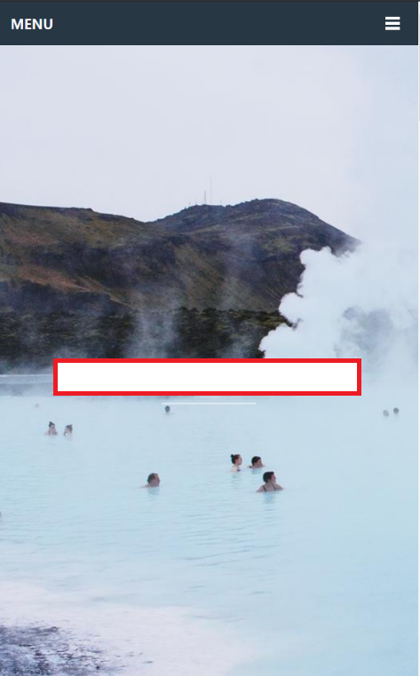
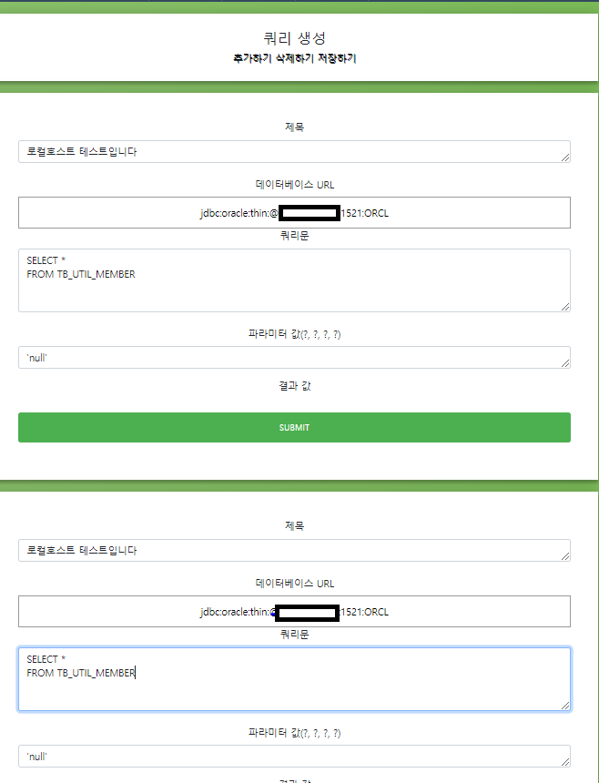

<h1>DB Query Util</h1>

결과값에 따라 다른 쿼리를 주어야 하는 경우 이러한 쿼리 리스트들을 저장하고 관리하기 위해 DB Query Util 프로그램을 만들었습니다.

 
<h1>목차</h1>
<ul>
  <li>목적</li>
  <li>기능</li>
  <li>결과물</li>
</ul>
 
<h1>목적</h1>

결과값에 따라 다른 쿼리를 주어야 하는 경우 이러한 쿼리 리스트들을 저장하고 관리하기 위해 DB Query Util 프로그램을 만들었습니다.

 
<h1>기능</h1>

데이터베이스 오라클 추가

오라클 CURD 기능 추가

RESTAPI로 접근 가능

게시판 기능 추가

권한 기능 추가

 
<h1>결과물</h1>

→ 페이지에 접근하면 위와 같은 뷰가 나오게 됩니다. 먼저 회원가입을 해야합니다. 

→ 회원가입 및 로그인 페이지입니다. 회원가입 후 로그인을 하면 게시판 및 회원유틸 시스템을 이용할 수 있습니다.

→ 먼저 데이터베이스 드라이버를 생성해야합니다. 개인이 사용해야 하는 데이터베이스의 정보를 입력하면 그 데이터베이스의 외부 접근 권한이 있는 DB일 경우 이용할 수 있습니다. 즉 데이터베이스를 여러개 입력하고 그 데이터베이스를 접근할 수 있다면 DML 명령어를 한 페이지에서 할 수 있습니다. 

→ 그래서 한 페이지에 여러 개의 쿼리를 생성하고, 생성한 쿼리마다 데이터베이스를 바꿀 수 있으며, 여러 쿼리문을 적용시킬 수 있기 때문에 다양한 측면에서 사용가능합니다.

→ 데이터베이스를 선택하는 공간입니다.

→  결과

 
